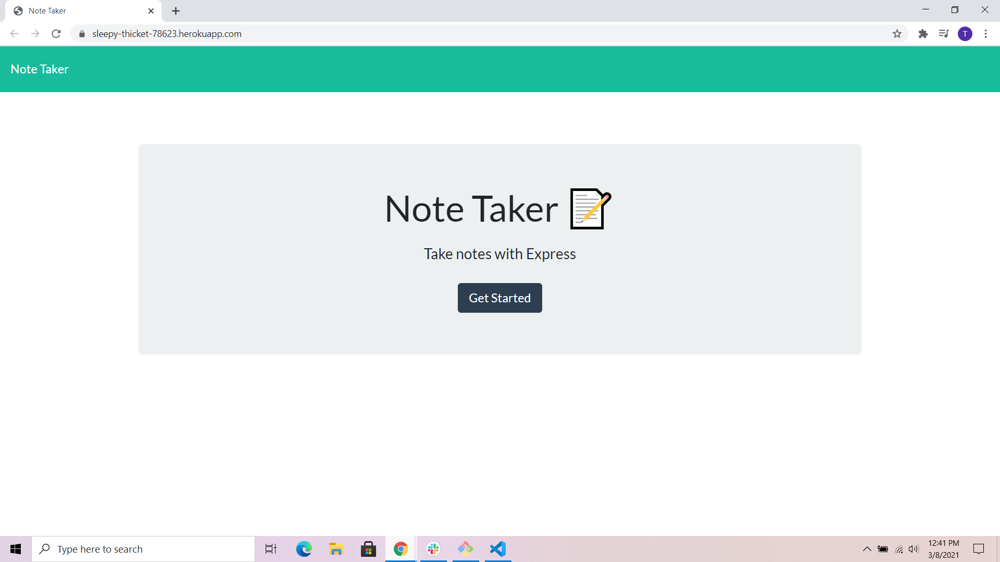
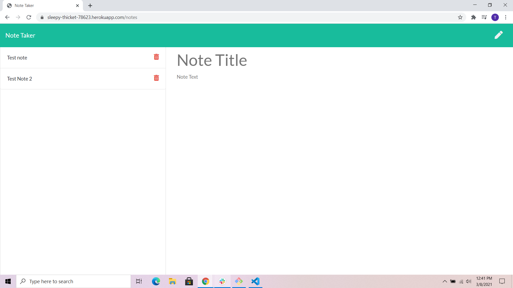

# Note_Taker

  
  ## License

  
  
  
  ## Description 
  
  *The what, why, and how:* 
  
  This is a web app made to make it easy to keep notes about anything you need to a note for. Like doctors appointments or needing to go to the bank or grocery list. You can save as many notes as you'd like. You are also able to delete notes after they are no longer needed. The front end came from UNH bootcamp and I made the server.

  
  ## Table of Contents
  
  * [Installation](#installation)
  * [Usage](#usage)
  * [Questions](#questions)
  * [Image](#image)
  * [Link](#link)

  
    
  ## Installation
  
  *Steps required to install project and how to get the development environment running:*
  
  First clone the repo from git. Then run in the command line npm install. Then type node server into the cammand line. Then go to localhost/3000.

  ## Usage

    Click get started. Then on the left side of the screen write the title of your note then the description of your note. You can then click the save button and your note will show up on in the list on the left handside.

  ## Questions
  
  This is how you can get a hold of me either at my Github account or by email.
  
  GiuHub username: [taroche](https://www.github.com/taroche)
  
  Email: [laroche11235@gmail.com](mailto:laroche11235@gmail.com)

  ## Image

  

  

  ## Link

  [Note Taker Website](https://sleepy-thicket-78623.herokuapp.com)

